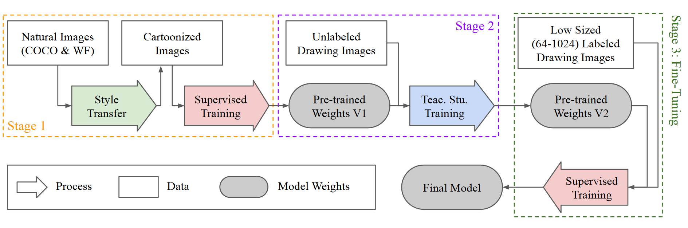
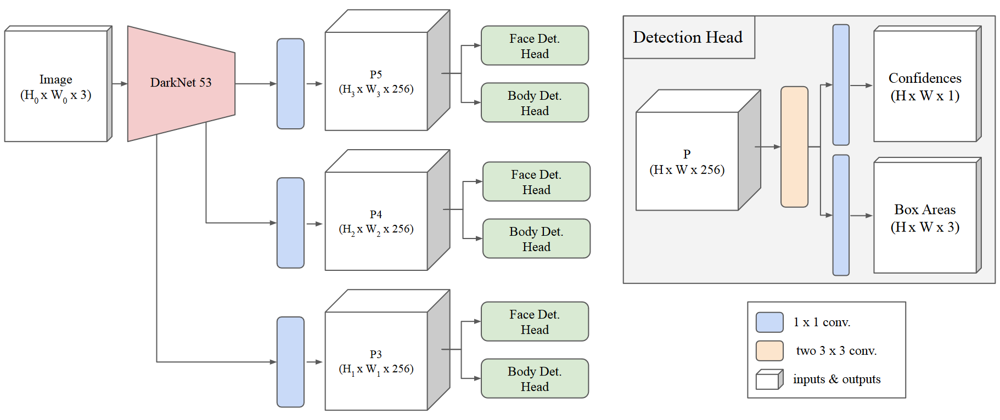
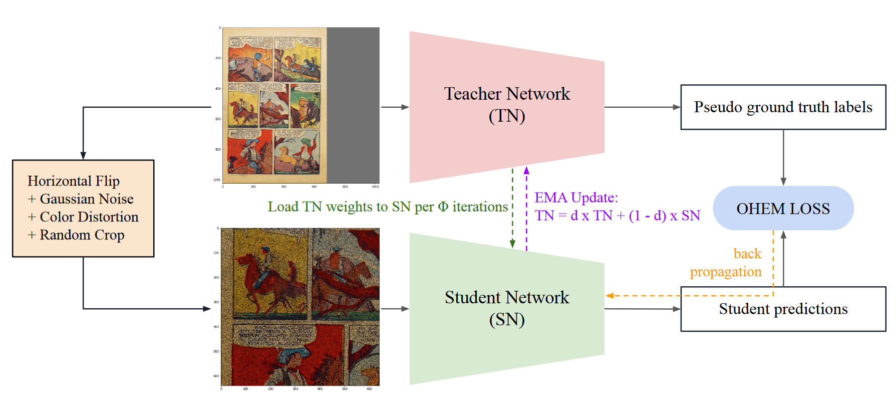
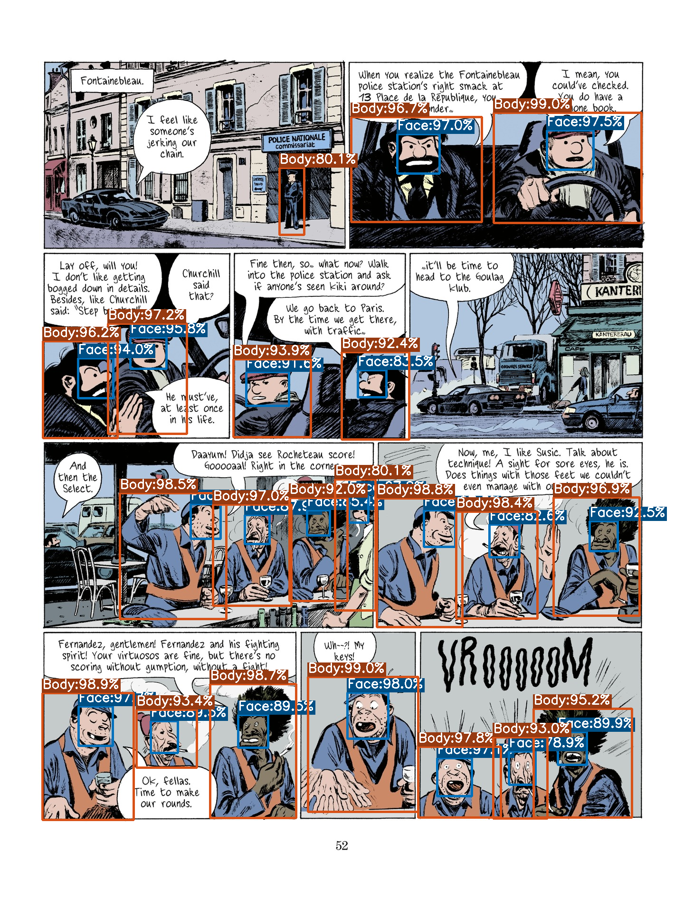
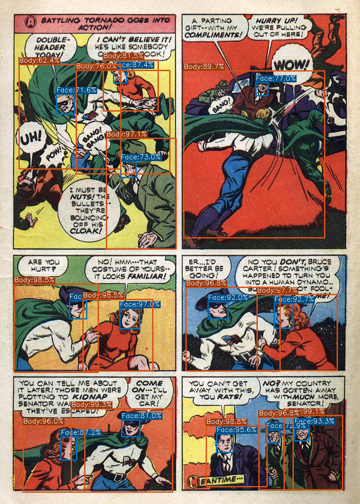
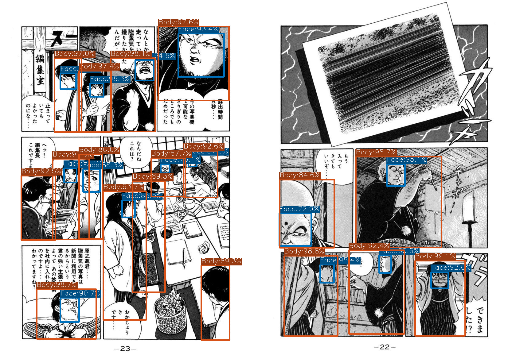

# DASS_Det_Inference

**Description:** Original Inference Repository of the ECCV 2022 Paper: "Domain-Adaptive Self-Supervised Pre-training for Face &amp; Body Detection in Drawings"

## Requirements

- CUDA >= 10.2
- PyTorch >= 1.8.2
- Chainer >= 7.8.1
- ChainerCV >= 0.13.1
- OpenCV-Python >= 4.5.5
- Matplotlib >= 3.3.4

## Abstract

Drawings are powerful means of pictorial abstraction and communication. Understanding diverse forms of drawings including digital arts, cartoons, and comics has been a major problem of interest for the computer vision and computer graphics communities. Although there are large amounts of digitized drawings from comic books and cartoons, they contain vast stylistic variations, which necessitate expensive manual labeling for training domain-specific recognizers. In this work, we show how self-supervised learning, based on a teacher-student network with a modified student network update design, can be used to build face and body detectors. Our setup allows exploiting large amounts of unlabeled data from the target domain when labels are provided for only a small subset of it. We further demonstrate that style transfer can be incorporated into our learning pipeline to bootstrap detectors using vast amount of out-of-domain labeled images from natural images (i.e., images from the real world). Our combined architecture yields detectors with state-of-the-art (SOTA) and near-SOTA performance using minimal annotation effort.

## Pre-trained Weights

You can find all the pre-trained model weights from [here](https://drive.google.com/drive/folders/1sQX36bWeIGoAGlQUiaUA9wnEUwtVsS76?usp=sharing). Please note that: 

- if the model name includes `xs`, then the depth and width parameters should be set as `depth, width = 0.33, 0.375`. If it includes `xl`, then `depth, width = 1.33, 1.25`. 
- for the stage-2 weights (i.e., self-supervised, teacher-student), load the model with the `teacher_model` key in the weight dictionary. Otherwise use `model` key.

## Model Architecture

### Overall Pipeline

### Model Architecture

## Self-Supervised Design

## Results 

The results shared below are calculated by averaging 5 separate training run outcomes. The best-performing models among these runs are given as the pre-trained weights. Please refer to the original paper for the complete set of results and ablation studies. 

### Face Results

Models                                                 | iCartoonFace | Manga109 | DCM772
---                                                    | ---          | ---      | --- 
**XS Stage-1 All Styles**                              | 42.50        | 54.74    | 69.93
**XS Stage-2 Self-Supervised**                         | 49.05        | 69.23    | 82.22
**XS Stage-3 Fine-Tuned w/ Single Datasets**           | 87.75        | 87.86    | 75.87
**XS Stage-3 Fine-Tuned w/ Mix of Datasets**           | -            | -        | -       
**XL Stage-3 Fine-Tuned**                              | -            | -        | -
[ACFD](https://arxiv.org/abs/2007.00899)               | 90.94        | -        | - 
[Ogawa et al.](https://arxiv.org/abs/1803.08670)       | -            | 76.20    | -
[Nguyen et al.](https://www.mdpi.com/2313-433X/4/7/89) | -            | -        | 74.94

### Body Results

Models                                                 | Manga109 | DCM772 | Comic2k | Watercolor2k | Clipart1k | eBDtheque
---                                                    | ---      | ---    | ---     | ---          | ---       | --- 
**XS Stage-1 All Styles**                              | 42.72    | 65.46  | 56.80   | 67.36        | 55.65     | 14.70
**XS Stage-2 Self-Supervised**                         | 69.41    | 77.83  | 67.38   | 71.60        | 64.12     | 25.22
**XS Stage-3 Fine-Tuned w/ Single Datasets**           | 87.06    | 84.89  | 71.66   | 89.17        | 77.97     | - 
**XS Stage-3 Fine-Tuned w/ Mix of Datasets**           | -        | -      | -       | -            | -         | -
**XL Stage-3 Fine-Tuned**                              | -        | -      | -       | -            | -         | -
[Ogawa et al.](https://arxiv.org/abs/1803.08670)       | 79.60    | -      | -       | -            | -         | -
[Nguyen et al.](https://www.mdpi.com/2313-433X/4/7/89) | -        | 76.76  | -       | -            | -         | -
[Inoue et al.](https://arxiv.org/abs/1803.11365)       | -        | -      | 70.10   | 77.30        | 76.20     | -

## Visual Examples from "XS Stage-3 Fine-Tuned w/ Mix of Datasets"

